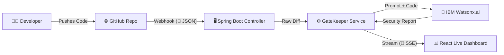

# 🛡️ GateKeeper AI

## 🔏 Automated Security Architect for Regulated Industries

---

### 🚨 The Problem

- 🏦 In Fintech and Banking, **Security Compliance** is the biggest bottleneck.
- ⏳ Developers wait days for manual security reviews.
- ⚠️ Simple mistakes like logging a password or hardcoding a key block deployments.
- 🧱 Security teams are overwhelmed and become the "Department of No."

---

### 🤖 The Solution: GateKeeper AI

GateKeeper is an **Autonomous AI Agent** that lives in your CI/CD pipeline.
It acts as a Virtual Security Architect, reviewing every Pull Request in real-time using **IBM Watsonx (Granite 3.0)**.

Unlike static tools (e.g., SonarQube) which just find syntax errors, GateKeeper understands context:

- 🕵️‍♂️ Detects complex vulnerabilities (Log Injection, SQLi, Weak Crypto)
- 📢 Explains why it is dangerous in plain English
- 🛠️ Fixes the code automatically, providing a copy-paste solution

---

### 🗂️ Technical Architecture



---

### 🧰 Tech Stack

- ☕ **Backend:** Java 21, Spring Boot 3.3
- 🧠 **AI Engine:** IBM Watsonx.ai (Model: ibm/granite-3-8b-instruct)
- 🔗 **Integration:** GitHub Webhooks + REST API
- 🎨 **Frontend:** Server-Side React + Tailwind CSS (Zero-Build)
- 📡 **Streaming:** Server-Sent Events (SSE) for real-time "Matrix Style" logs

---

### 🔒 Key Features

1. **🧠 Context-Aware Analysis**
    - GateKeeper doesn't just regex for password. It understands variable naming and flow.
    - ✅ Safe: `logger.info("User logged in")`
    - ❌ Unsafe: `logger.info("User password: " + pass)` (CWE-532)

2. **📊 Live Security Dashboard**
    - A real-time, dark-mode dashboard that streams the agent's thought process and analysis results via SSE.

3. **🛠️ Auto-Remediation**
    - It doesn't just block you; it teaches you.
    - **Before:**
      ```java
      String query = "SELECT * FROM users WHERE id = " + input;
      ```
    - **GateKeeper Fix:**
      ```java
      String query = "SELECT * FROM users WHERE id = ?";
      PreparedStatement stmt = conn.prepareStatement(query);
      stmt.setString(1, input);
      ```

---

### 🚦 How to Run

#### 1️⃣ Prerequisites

- ☕ Java 21
- 🧰 Maven
- ☁️ IBM Cloud Account (Watsonx.ai)

#### 2️⃣ Configuration

Update `src/main/resources/application.properties`:

```properties
spring.ai.watsonx.ai.iam-token=YOUR_IBM_TOKEN
spring.ai.watsonx.ai.project-id=YOUR_WATSONX_PROJECT_ID
spring.ai.watsonx.ai.base-url=https://us-south.ml.cloud.ibm.com
```

##### 🔑 Generate IBM IAM Token

Use the following curl command to generate your IBM IAM token:

```bash
curl --location 'https://iam.cloud.ibm.com/identity/token' \
--header 'Content-Type: application/x-www-form-urlencoded' \
--data-urlencode 'grant_type=urn:ibm:params:oauth:grant-type:apikey' \
--data-urlencode 'apikey=YOUR_IBM_API_KEY'
```

Replace `YOUR_IBM_API_KEY` with your actual IBM Cloud API key. The response will contain your IAM token to use in the configuration above.

#### 3️⃣ Start the Agent

```bash
mvn spring-boot:run
```

#### 4️⃣ Trigger the Scan

- 🌐 **Option A:** Configure a GitHub Webhook to `http://your-ngrok-url/api/webhook`.
- 📝 **Option B (Manual):** Send a POST request to `http://localhost:8080/api/webhook` with a Pull Request payload.

#### 5️⃣ View Dashboard

Open [http://localhost:8080](http://localhost:8080) to watch the agent work live.

---

### 🏆 Hackathon Notes

- 🧠 **Model:** Granite 3.0 8B Instruct for superior code-understanding capabilities compared to generic LLMs.
- ⚙️ **Resilience:** Includes a "Simulation Mode" fallback if GitHub API limits are hit during the demo.

---

*Built with integrity and innovation for IBM Dev Day*
